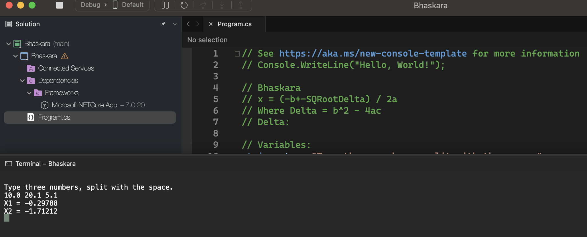
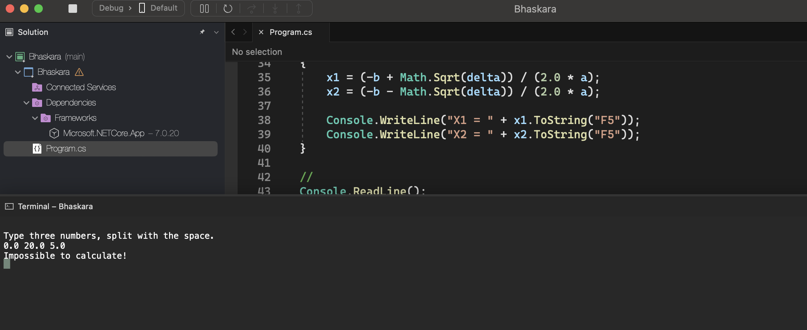

# Bhaskara

    - Read the values ​​of the three coefficients "a", "b" and "c" of a second-degree (ax^2 + bx + c = 0).
    Then, show the values ​​of the roots of the equation, according to examples, using the Baskara formula (see below). If the equation does not have roots (the value of "a" cannot be zero, and the value of "delta" cannot be negative), it will show a message "Unable to calculate".

    Formula: (x = -b +- squareroot of delta / 2a) where: delta = b^2 - 4ac

### Examples:

    input:                                                  output:
    10.0 20.1 5.1                                           X1 = -0.29788
                                                            X2 = -1.71212

    input:                                                  output:
    0.0 20.0 5.0                                            Impossible to calculate

    input:                                                  output:
    10.3 203.0 5.0                                          X1 = -0.02466
                                                            X2 = -19.68408

    input:                                                  output:
    10.0 3.0 5.0                                            Impossible to calculate

  

  

