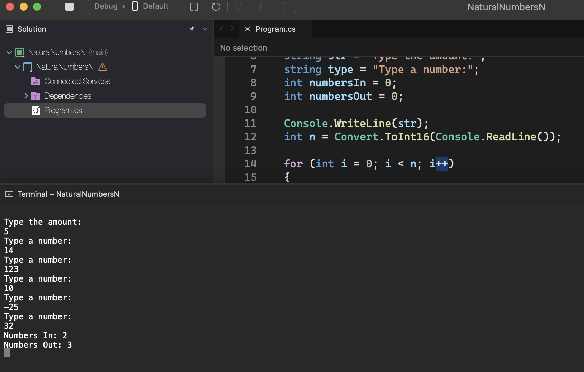
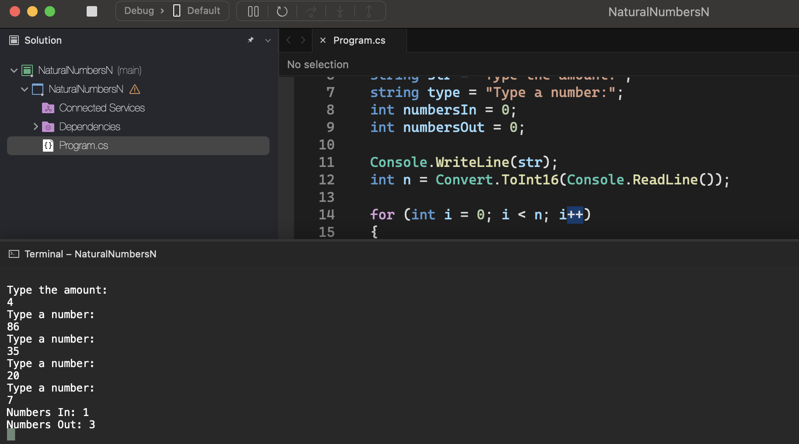

# Sequential Structure

    - Read an integer value N. This value will be the number of integer values ​​X that will be read next.
    Show how many of these X values ​​are within the range [10,20] and how many are outside the range, showing this information as per example (use the word "in" for inside the range, and "out" for outside the range).

### Examples:

    input:                                                  output:
    5                                                       2 in
    14                                                      3 out
    123
    10
    -25
    32

    input:                                                  output:
    4                                                       1 in
    86                                                      3 out
    35
    20
    7

  

  

