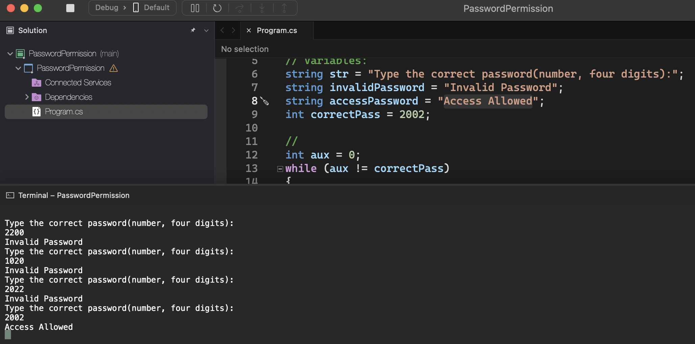
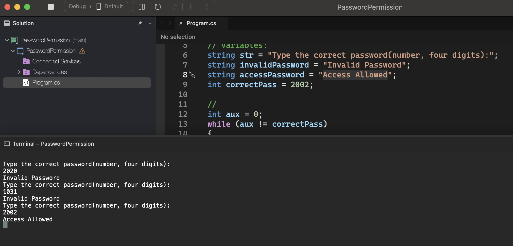

# Sequential Structure

    - Write a program that repeats reading a password until it is valid. For each incorrect password read, write the message "Invalid Password". When the password is entered correctly, the message "Access Allowed" should be printed and the algorithm terminated. Consider that the correct password is the value 2002.

### Examples:

    input:                                                  output:
    2200                                                    Invalid Password
    1020                                                    Invalid Password
    2022                                                    Invalid Password
    2002                                                    Access Allowed

    input:                                                  output:
    2020                                                    Invalid Password
    1031                                                    Invalid Password
    2002                                                    Access Allowed

  

  

