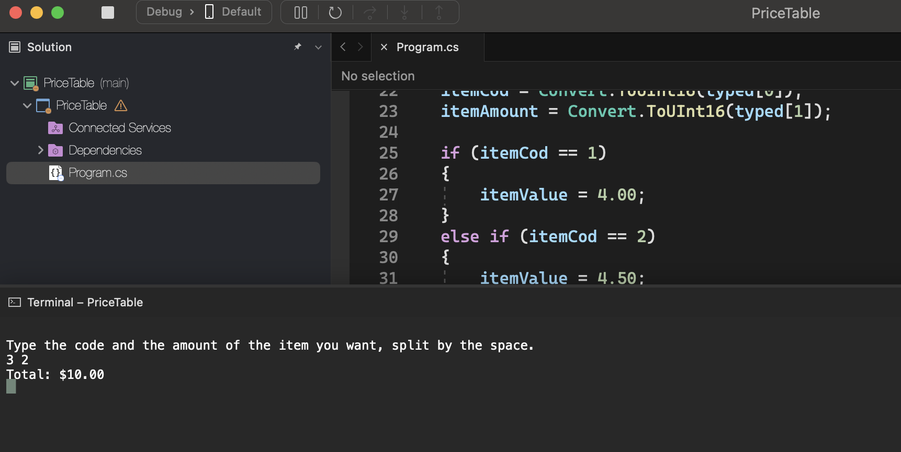
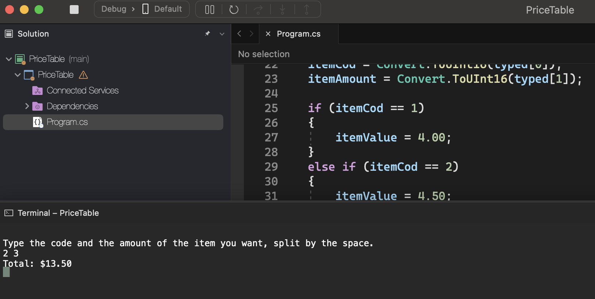

# Sequential Structure

    - Based on the price table on the side, write a program that reads the code of an item and the quantity of this item. Next, calculate and show the amount of the bill payable.

    CODE                    SPECIFICATION                 PRICE
    1                       hotdog                       $4.00
    2                       X-salad                       $4.50
    3                       X-bacon                       $5.00
    4                       simple toast                  $2.00
    5                       soft drink                    $1.50

### Examples:

    input:                                                  output:
    3 2                                                     Total: $10.00

    input:                                                  output:
    2 3                                                     Total: $13.50

  

  

