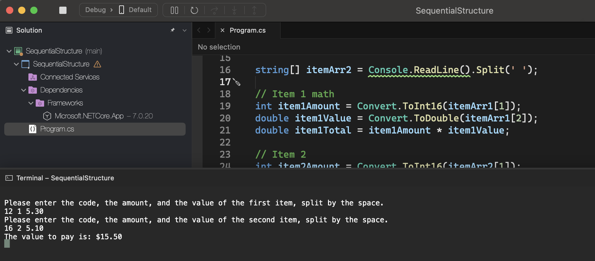

# Sequential Structure

    - Make a program to read the code of a part 1, the number of parts 1, the unit value of each part 1, the code of a part 2, the number of parts 2 and the unit value of each part 2. Calculate and show the amount to be paid.

### Examples:

    input:                                                  output:
    12 1 5.30                                               The value to pay is: $15.50
    16 2 5.10

    input:                                                  output:
    13 2 15.30                                              The value to pay is: $51.40
    161 4 5.20

    input:                                                  output:
    1 1 15.10                                               The value to pay is: $30.20
    2 1 15.10

  

  

