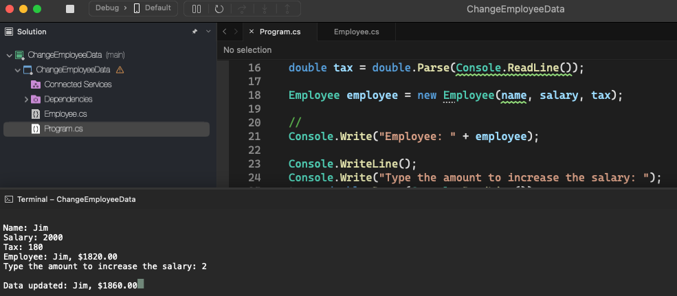

# Change Employee Data

    - Implementing an Employee class, it will add the employee's data, name, salary and tax, it will show the information with the updated information, it will ask the precentage of salary increase we want to add, and it will show the updated information;

  

