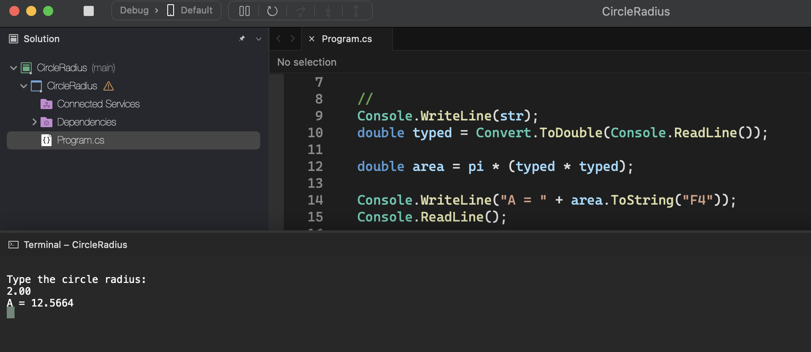
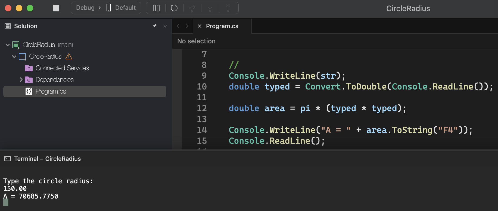

# Circle Radius

    - Write a program to read the value of the radius of a circle, and then display the value of the area of ​​this circle with four decimal places as per the examples.

### Examples:

    input:                                                  output:
    2.00                                                    A = 12.5664

    input:                                                  output:
    100.64                                                  A = 31819.3103

    input:                                                  output:
    150.00                                                  A = 70685.7750

  

  

