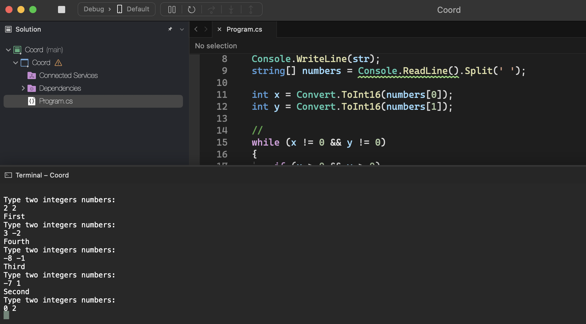

# Coord

    - Write a program to read the coordinates (X,Y) of an indeterminate number of points in the Cartesian system. For each point, write the quadrant to which it belongs. The algorithm will terminate when at least one of the two coordinates is NULL (in this situation without writing any message).

### Examples:

    input:                                                  output:
    2 2                                                     First
    3 -2                                                    Fourth
    -8 -1                                                   Third
    -7 1                                                    Second
    0 2

  

