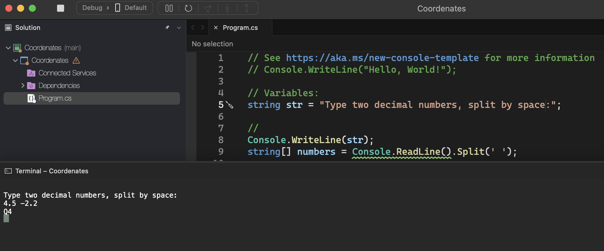

# Coordenates

    - Read 2 values ​​with one decimal place (x and y), which must represent the coordinates of a point on a plane. Next, determine which quadrant the point belongs to, or whether it is on one of the Cartesian axes or at the origin (x = y = 0).
    If the point is at the origin, write the message “Origin”.
    If the point is on one of the axes, write “X Axis” or “Y Axis”, depending on the situation.

  

### Examples:

    input:                                                  output:
    4.5 -2.2                                                Q4

    input:                                                  output:
    0.1 0.1                                                 Q1

    input:                                                  output:
    0.0 0.0                                                 Origem

  

  

