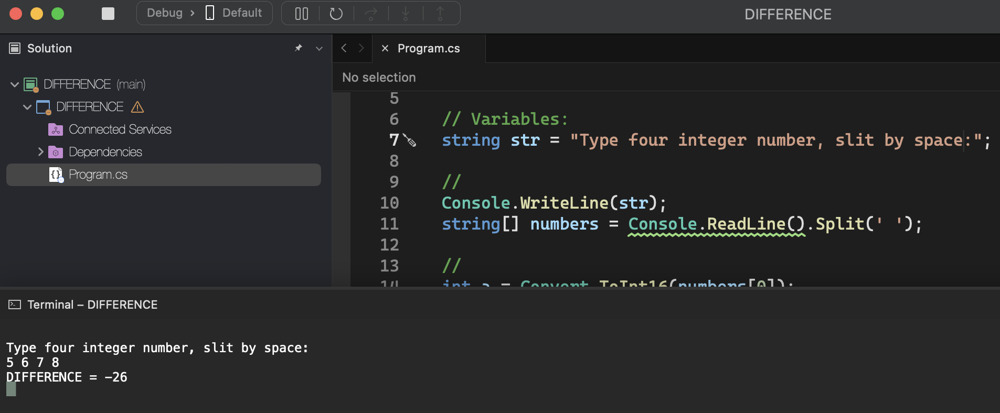
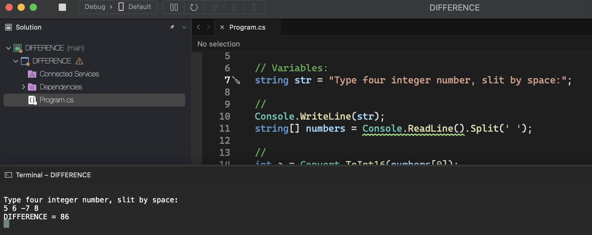

# DIFFERENCE

    - Make a program to read four integer values ​​A, B, C and D. Then, calculate and show the difference between the product of A and B and the product of C and D according to the formula: DIFFERENCE = (A * B - C * D).

### Examples:

    input:                                                  output:
    5                                                       DIFFERENCE = -26
    6
    7
    8

    input:                                                  output:
    5                                                       DIFFERENCE = 86
    6
    -7
    8

  

  

