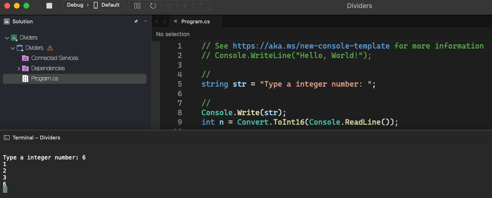

# Dividers

    - Read an integer N and calculate all its divisors.

### Examples:

    input:                                                  output:
    6                                                       1
                                                            2
                                                            3
                                                            6

  

