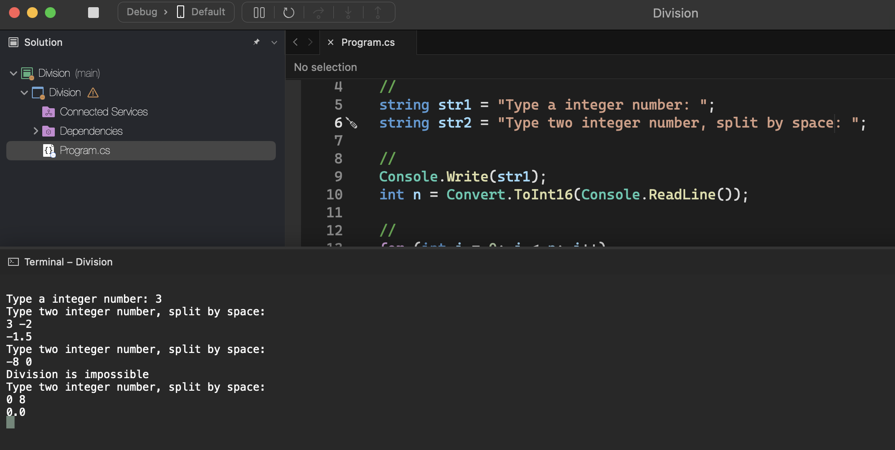

# Division

    - Make a program to read a number N. Then read N pairs of numbers and show the division of the first by the second. If the denominator is equal to zero, the message "division impossible" will be displayed.

### Examples:

    input:                                                  output:
    3                                                       -1.5
    3 -2                                                    division impossible
    -8 0                                                    0.0
    0 8

  

