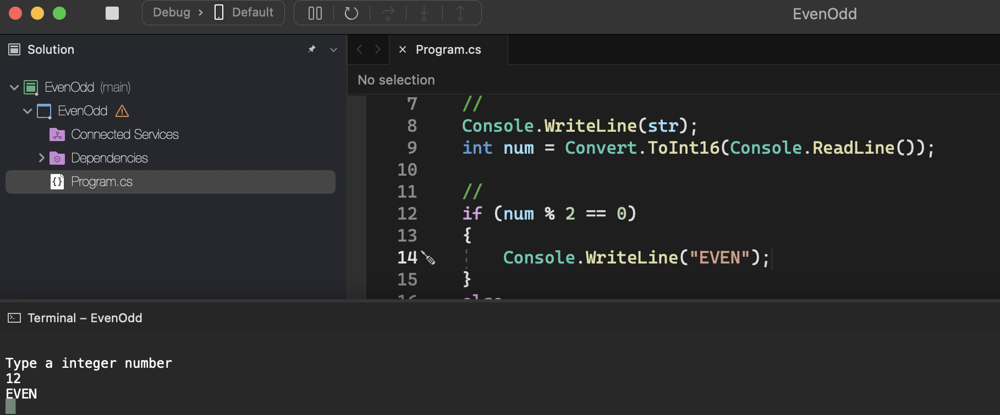
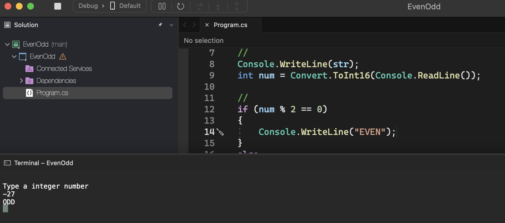

# Even Odd

    - Make a program to read an integer and tell if this number is even or odd.

### Examples:

    input:                                                  output:
    12                                                      Even

    input:                                                  output:
    -27                                                     Odd

    input:                                                  output:
    0                                                       Even

  

  

