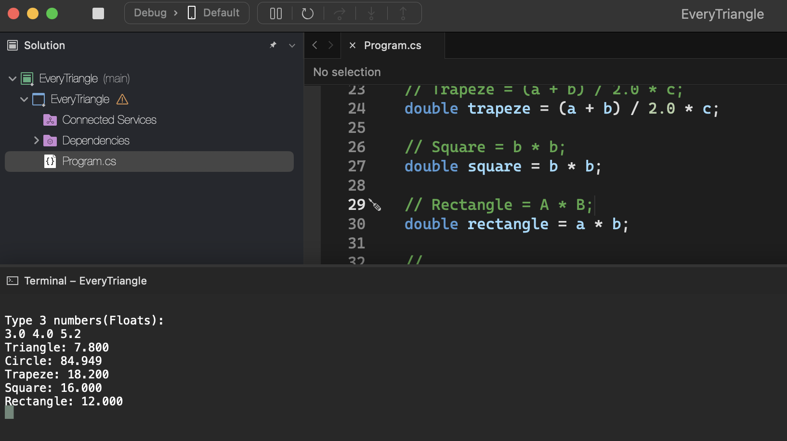
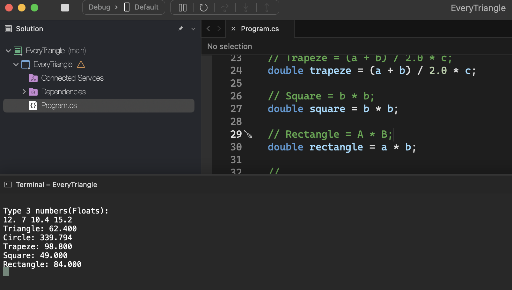

# Area of ​​Solids

    - Make a program that reads three double-precision floating point values: A, B, and C. Then calculate and show:
    a) the area of ​​the right triangle that has A as its base and C as its height.
    b) the area of ​​the circle of radius C. (pi = 3.14159)
    c) the area of ​​the trapezoid that has A and B for bases and C for height.
    d) the area of ​​the square that has side B.
    e) the area of ​​the rectangle that has sides A and B.

### Examples:

    input:                                                  output:
    3.0 4.0 5.2                                             TRIANGLE: 7.800
                                                            CIRCLE: 84.949
                                                            TRAPEZE: 18.200
                                                            SQUARE: 16.000
                                                            RECTANGLE: 12.000

    input:                                                  output:
    3.0 4.0 5.2                                             TRIANGLE: 96.520
                                                            CIRCLE: 725.833
                                                            TRAPEZE: 175.560
                                                            SQUARE: 108.160
                                                            RECTANGLE: 132.080

  

  

