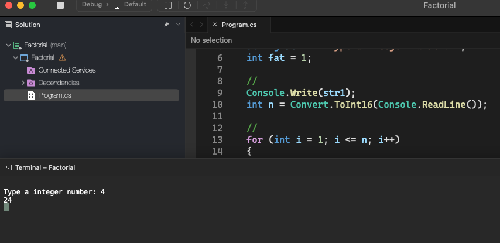
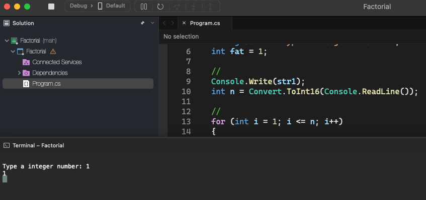

# Factorial

    - Read a value N. Calculate and write its respective factorial. Factorial of N = N * (N-1) * (N-2) * (N-3) * ... * 1. Remembering that, by definition, factorial of 0 is 1.

### Examples:

    input:                                                  output:
    4                                                       24

    input:                                                  output:
    1                                                       1

    input:                                                  output:
    5                                                       120

    input:                                                  output:
    0                                                       1

  

  

