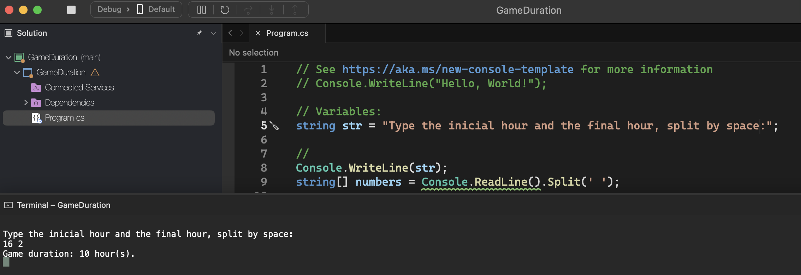
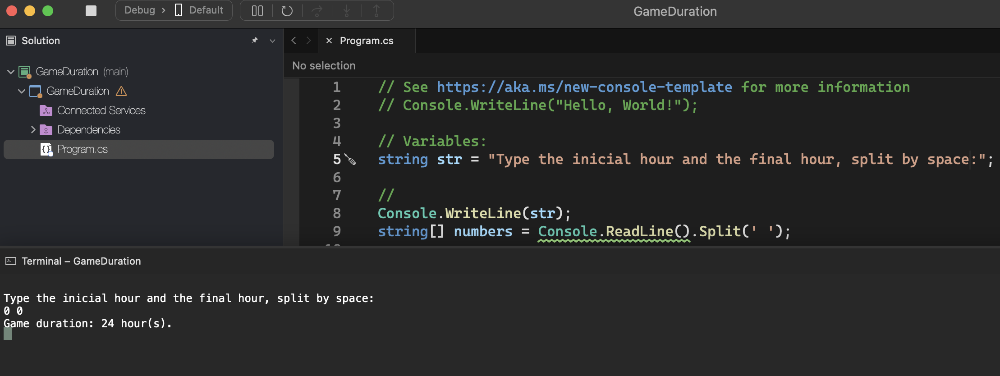

# Game Duration

    - Read the start time and end time of a game. Then calculate the duration of the game, knowing that it can start on one day and end on another, lasting a minimum of 1 hour and a maximum of 24 hours.

### Examples:

    input:                                                  output:
    16 2                                                    Game duration: 10 hour(s).

    input:                                                  output:
    0 0                                                     Game duration: 24 hour(s).

    input:                                                  output:
    2 16                                                    Game duration: 14 hour(s).

  

  

