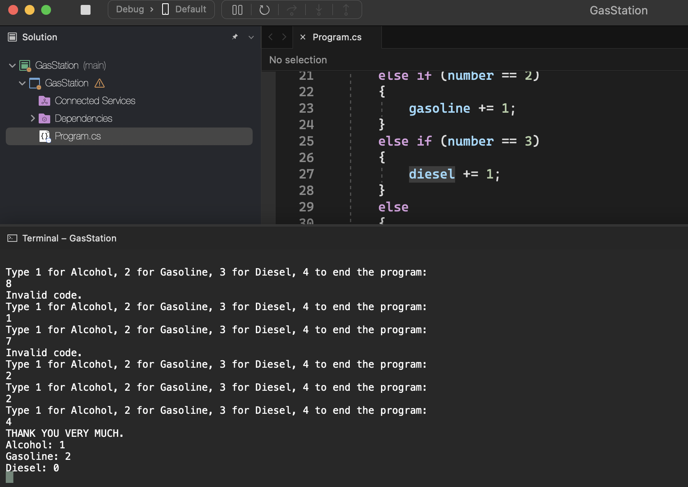

# Gas Station

    - A gas station wants to determine which of its products its customers prefer. Write an algorithm to read the type of fuel supplied (coded as follows: 1.Alcohol 2.Gasoline 3.Diesel 4.Fim). If the user enters an invalid code (outside the range 1 to 4), a new code must be requested (until it is valid). The program will end when the code entered is number 4. The message must be written: "THANK YOU VERY MUCH" and the number of customers who filled each type of fuel, as per the example.

### Examples:

    input:                                                  output:
    8                                                       THANK YOU VERY MUCH
    1                                                       Alcohol: 1
    7                                                       Gasoline: 2
    2                                                       Diesel: 0
    2
    4

  

