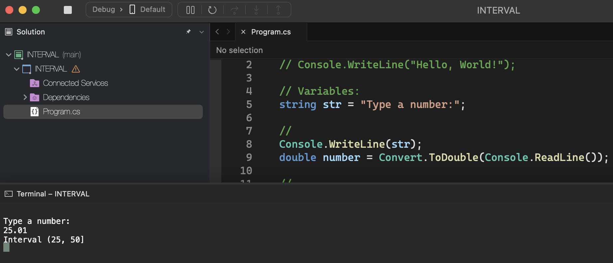
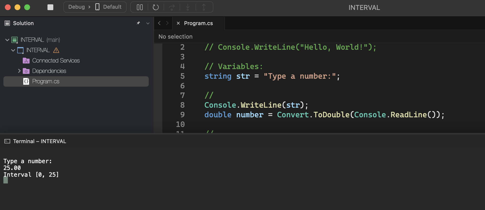

# Interval

    - You must write a program that reads any value and displays a message saying which of the following ranges ([0,25], (25,50], (50,75], (75,100]) this value is located. Obviously if the value is not in any of these ranges, the message “Out of range” must be printed.

### Examples:

    input:                                                  output:
    25.01                                                   Interval (25, 50]

    input:                                                  output:
    25.00                                                   Interval [0, 25]

    input:                                                  output:
    100.00                                                  Interval (75, 100]

    input:                                                  output:
    -25.02                                                  Out of interval

  

  

