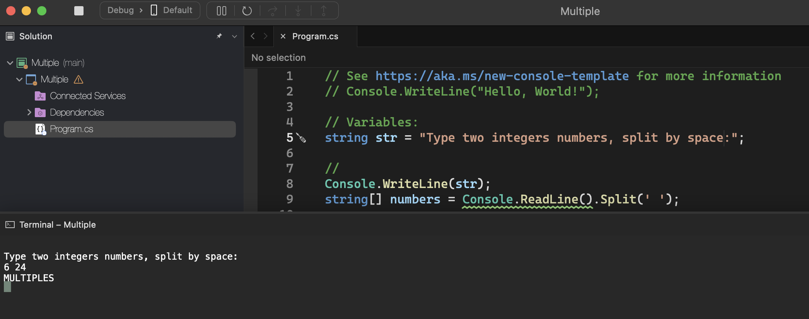
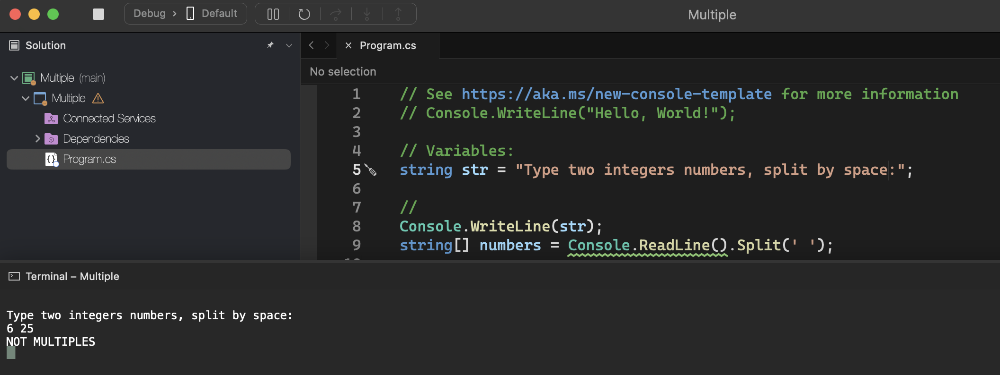

# Multiple

    - Read 2 integer values ​​(A and B). Afterwards, the program should display a message "Are Multiples" or "Not Multiple", indicating whether the values ​​read are multiples of each other. Attention: numbers must be able to be entered in ascending or descending order.

### Examples:

    input:                                                  output:
    6 24                                                    Are Multiples

    input:                                                  output:
    6 25                                                    Not Multiples

    input:                                                  output:
    24 6                                                    Are Multiples

  

  

