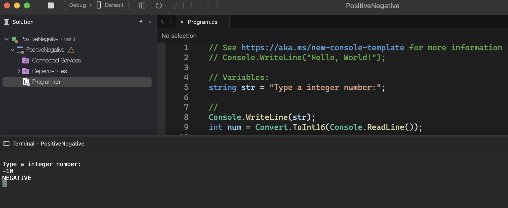
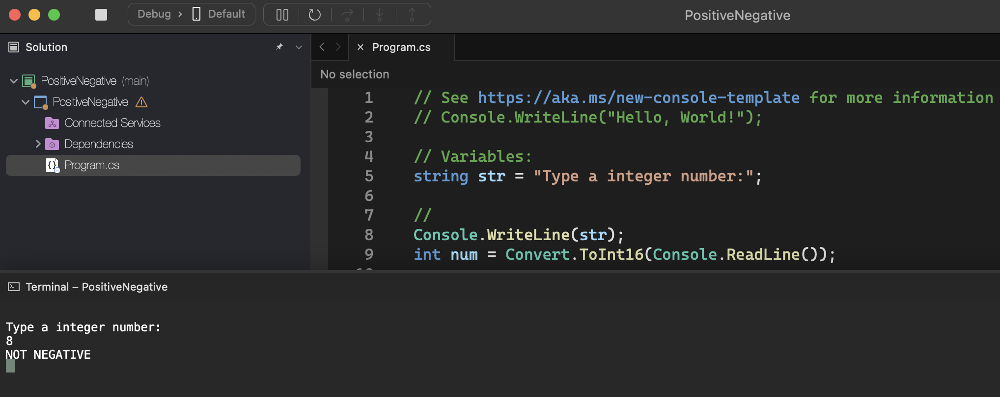

# Positive Negative

    - Make a program to read an integer, and then say whether this number is negative or not.

### Examples:

    input:                                                  output:
    -10                                                     NEGATIVE

    input:                                                  output:
    8                                                       NOT NEGATIVE

    input:                                                  output:
    0                                                       NOT NEGATIVE

  

  

