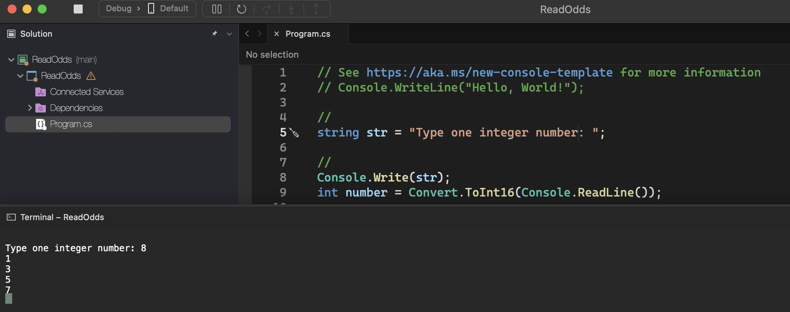

# Read Odds

    - Read an integer value X (1 <= X <= 1000). Then show the odd numbers from 1 to X, one value per line, including X, if applicable.

### Examples:

    input:                                                  output:
    8                                                       1
                                                            3
                                                            5
                                                            7

  

