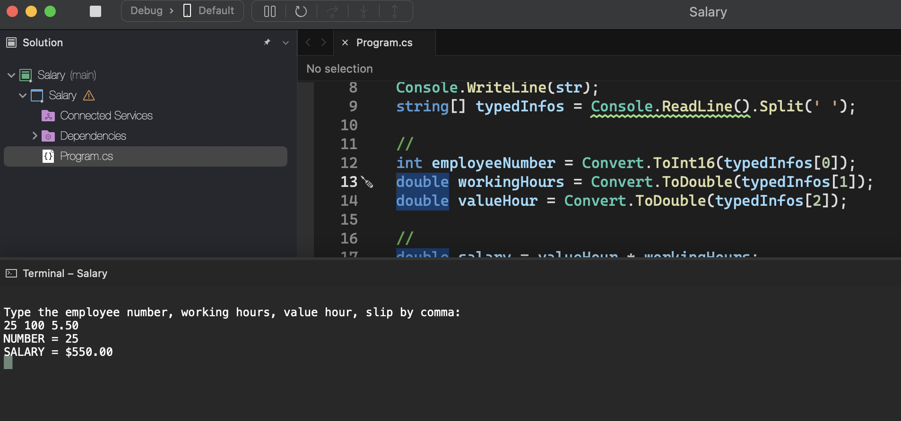
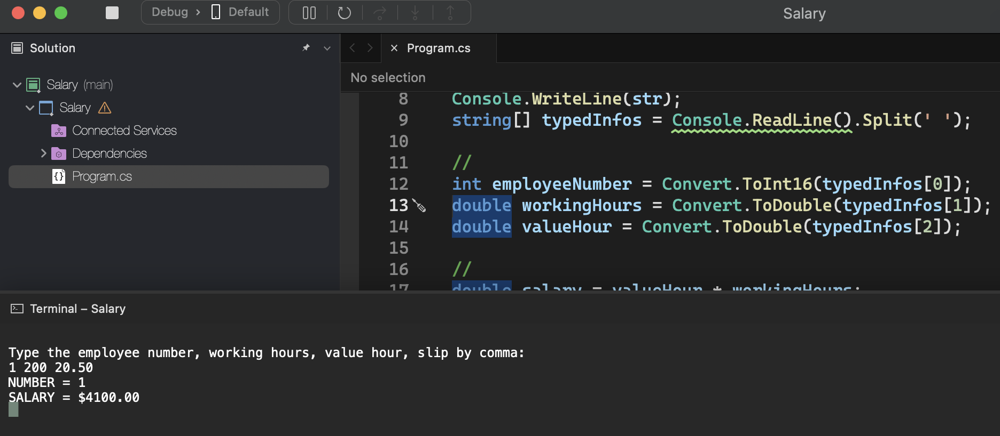

# Salary

    - Make a program that reads an employee's number, his number of hours worked, the amount he receives per hour and calculates that employee's salary. Next, show the employee's number and salary, with two decimal places.

### Examples:

    input:                                                  output:
    25                                                      NUMBER = 25
    100                                                     SALARY = U$ 550.00
    5.50

    input:                                                  output:
    1                                                       NUMBER = 1
    200                                                     SALARY = U$ 4100.00
    20.50

    input:                                                  output:
    6                                                       NUMBER = 6
    145                                                     SALARY = U$ 2254.75
    15.55

  

  

