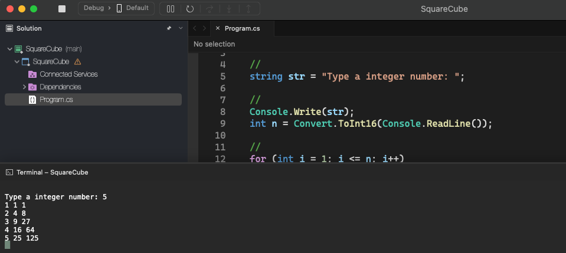

# Square Cube

    - Make a program to read a positive integer N. The program should then display N lines on the screen, starting from 1 to N. For each line, show the line number, then the square and cube of the value, as per the example.

### Examples:

    input:                                                  output:
    5                                                       1 1 1
                                                            2 4 8
                                                            3 9 27
                                                            4 16 64
                                                            5 25 125

  

