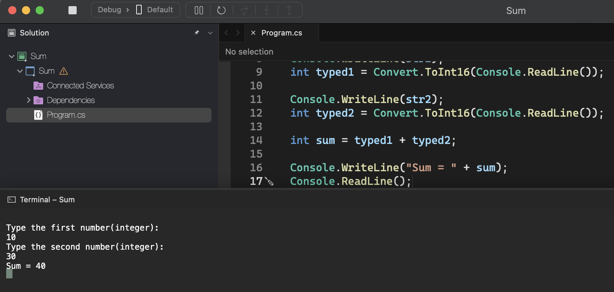
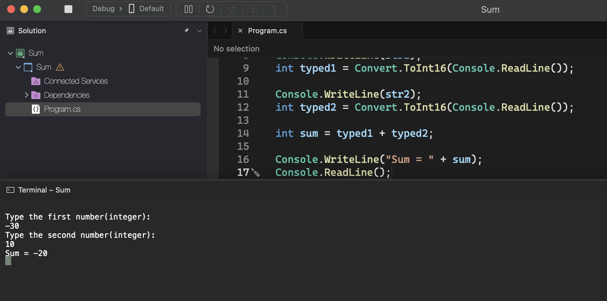

# Sum

    - Write a program to read two integer values, and then display the sum of these numbers on the screen with an explanatory message, as per the examples.

### Examples:

    input:                                                  output:
    10                                                      Sum = 40
    30

    input:                                                  output:
    -30                                                     Sum = -20
    10

    input:                                                  output:
    0                                                       Sum = 0
    0

  

  

