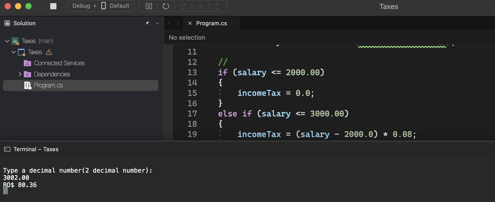
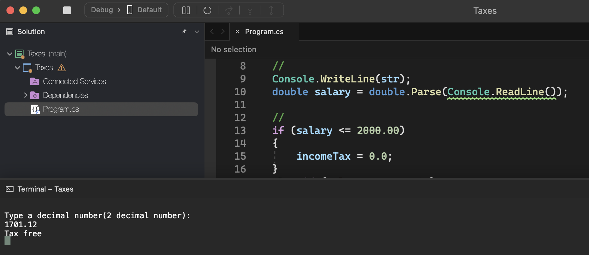

# Taxes

    - In an imaginary country called Lisarb, all inhabitants are happy to pay their taxes, as they know that there are no corrupt politicians and the resources collected are used for the benefit of the population, without any diversion. The currency of this country is the Rombus, whose symbol is RO$.

    Read a value to two decimal places, equivalent to a person's salary from Lisarb. Then, calculate and show the amount this person must pay in Income Tax, according to the table below.

    Income:                                                 Income tax:
    from 0.00 to RO$ 2000.00                                Tax Free
    from 2000.01 to RO$ 3000.00                             8 %
    from 3000.01 to RO$ 4500.00                             18 %
    above RO$ 4500.00                                       28 %

    Remember that, if the salary is RO$3002.00, the rate that applies is 8% only on RO$1000.00, as the salary range from RO$0.00 to RO$2000.00 is exempt from Income Tax. In the example provided (below), the rate is 8% on RO$1000.00 + 18% on RO$2.00, which results in RO$80.36 in total. The value must be printed with two decimal places.

### Examples:

    input:                                                  output:
    3002.00                                                 RO$ 80.36

    input:                                                  output:
    1701.12                                                 Tax Free

    input:                                                  output:
    4520.00                                                 RO$ 355.60

  

  

