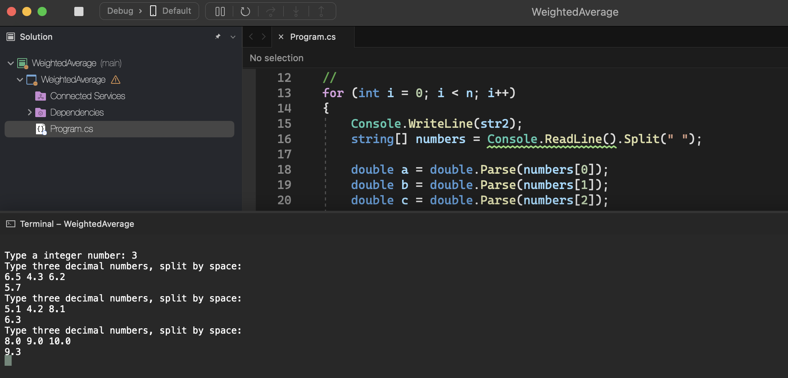

# Weithed Average

    - Read 1 integer value N, which represents the number of test cases that come next. Each test case consists of 3 real values, each with one decimal place. Present the weighted average for each of these sets of 3 values, with the first value having a weight of 2, the second value having a weight of 3 and the third value having a weight of 5.

### Examples:

    input:                                                  output:
    3                                                       5.7
    6.5 4.3 6.2                                             6.3
    5.1 4.2 8.1                                             9.3
    8.0 9.0 10.0

  

