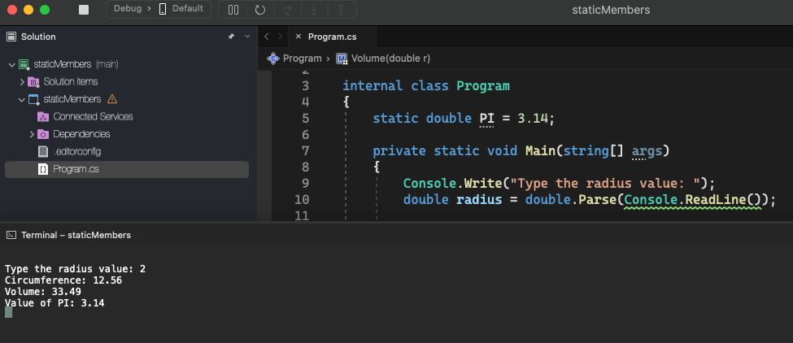

# Static Members

    - This is a recap on how to work with static members;

    - We difine a member as static using the "static" keyword;
    - When we declare a member of a class as static it means no matter how many objects of the class are created, there is only one copy of the static member.
    - A static member is shared by all objects of the class;

  

