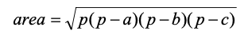
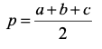
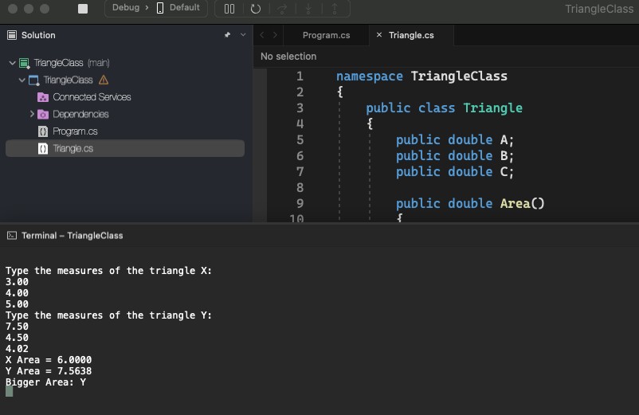

# Triangle Class

    - Make a program to read the measurements of the sides of two triangles X and Y (assume valid measurements). Then, show the value of the areas of the two triangles and say which of the two triangles has the greater area.

    The formula for calculating the area of ​​a triangle from the measurements of its sides a, b and c is as follows (Heron's formula):

  

    where:

  

### Examples:

    input:                                                  output:
    Enter the measurements of triangle X:                   X Area = 6.0000
    3.00                                                    Y Area = 7.5638
    4.00                                                    Bigger Area: Y
    5.00
    Enter the measurements of triangle Y:
    7.50
    4.50
    4.02

  

