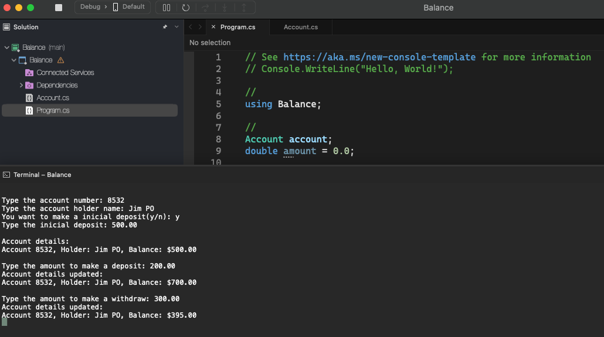

# Balance

    - At a bank, to register a bank account, it is necessary to provide the account number, the name of the account holder, and the initial deposit amount that the holder deposited when opening the account. This initial deposit amount, however, is optional, that is: if the holder does not have money to deposit when opening their account, the initial deposit will not be made and the account's initial balance will, naturally, be zero.
    Important: Once a bank account has been opened, the account number can never be changed. The name of the holder can be changed (as a person can change their name upon marriage, for example).
    Finally, the account balance cannot be changed freely. There needs to be a mechanism to protect this. The balance only increases through deposits, and only decreases through withdrawals. For each withdrawal made, the bank charges a fee of $5.00. Note: the account may have a negative balance if the balance is not sufficient to make the withdrawal and/or pay the fee.
    You must create a program that registers an account, giving you the option to inform the initial deposit amount or not. Then, make a deposit and then a withdrawal, always showing your account details after each operation.

  

