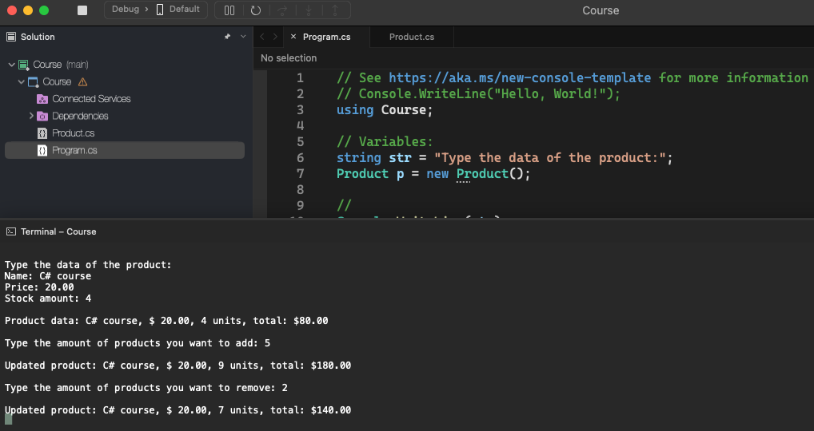

# Course

    - Implementation of a class Product, will add the product with that product's data, add the quantity and update the information, ask if we want to remove, and update the information accordintly;

  

