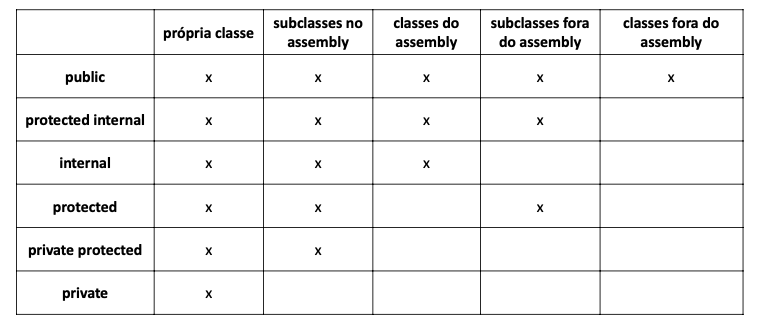

# 05 Section - Constructors, this word, overloading, encapsulation

    - This section was a recap to constructors, this word, overloading, encapsulation.

### Constructors

- It is a special operation of the class, which executes when the object is instantiated;

- Common uses:
  • Initialize attribute values;
  • Allow or force the object to receive data/dependencies at the time of its instantiation (dependency injection);

- If a custom constructor is not specified, the class makes the default constructor available:
  • Product p = new Product();

- It is possible to specify more than one constructor in the same class (overloading);

### The key work "this"

    - The “this” keyword in C# is used to refer to the current instance of the class. It is also used to differentiate between the method parameters and class fields if they both have the same name.

    - Another usage of “this” keyword is to call another constructor from a constructor in the same class.

### Overloading

    - You can have multiple definitions for the same function name in the same scope. The definition of the function must differ from each other by the types and/or the number of arguments in the argument list.

    - Overloaded operators are functions with special names. The keyword operator is followed by the symbol for the operator being defined.

    example:

    public static Triangle operator+ (Triangle b, Triangle b) {
      Triangle triangle = new Triangle();
      triangle.length = b.length + c.length;
      triangle.width = b.width + c.width;
      triangle.height = b.height + c.height;
      return triangle;
    }

### Encapsulation

    - It is a principle that consists of hiding the implementation details of a component, exposing only safe operations that keep it in a consistent state.

    - Rule of thumb: the object must always be in a consistent state, and the class itself must guarantee this.

### Properties

    - They are definitions of encapsulated methods, but exposing a syntax similar to that of attributes and not methods:
      • A property is a member that provides a flexible mechanism for reading,
        record or calculate the value of a particular field. Properties can be used as if they were public attributes, but they are actually special methods called "accessors". This allows data to be accessed easily and also helps promote the security and flexibility of methods.

### Suggested order

    - Private attributes
    - Self-implemented properties
    - Constructors
    - Custom properties
    - Other class methods

### Members

  

