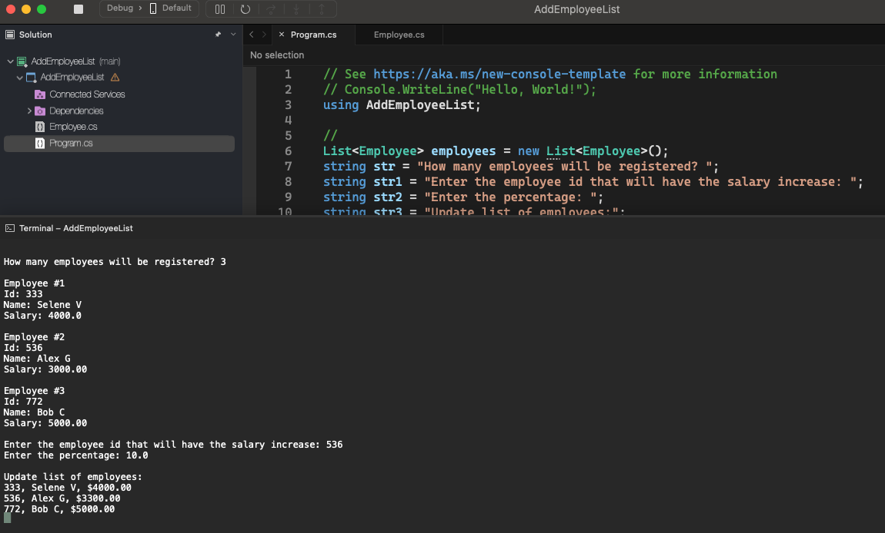

# Add Employee List

    - Make a program to read an integer N and then the data (id, name and salary) of N employees. There must be no repetition of id.
    Then, increase the salary of a specific employee by X percent. To do this, the program must read an id and the value X. If the id entered does not exist, display a message and abort the operation. At the end, show the updated list of employees, according to the examples.
    Remember to apply the encapsulation technique to prevent the salary from being changed freely. A salary can only be increased based on a given percentage increase operation.
    This is a list exercise.

  

