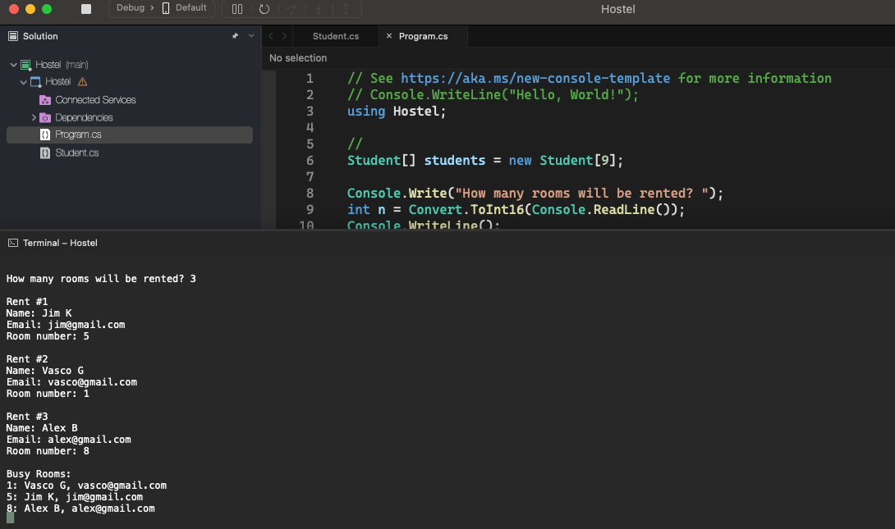

# Hostel

    - The owner of a boarding house has ten rooms to rent to students, these rooms being identified by numbers 0 to 9.
      When a student wants to rent a room, the student's name and email must be registered.
      Make a program that starts with all ten rooms empty, and then reads a quantity N representing the number of students who will rent rooms (N can be from 1 to 10). Then record the rent for the N students. For each rental record, enter the student's name and email, as well as which of the rooms they chose (from 0 to 9). Suppose a spare room is chosen. At the end, your program must print a report of all occupations in the boarding house, in order of room, as per the example.
    - This is an array of objects exercise.

  

