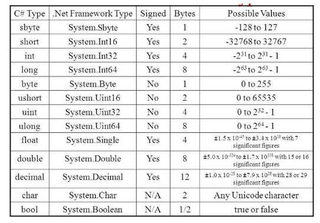
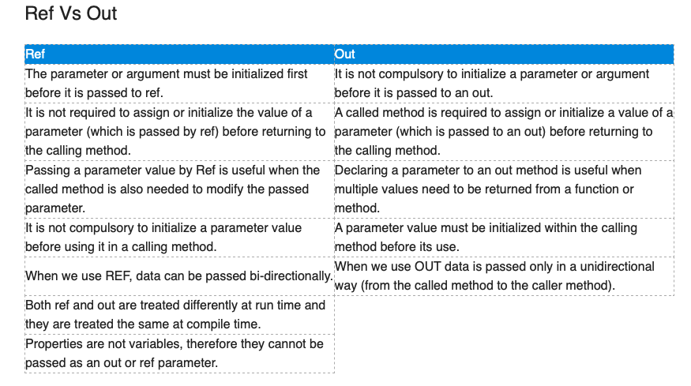

# 06 Section - Memory behavior, arrays, lists

      - This section was a recap of memory behavior, arrays and lists.

### Memory behavior

    - In C#, #memory is divided into two regions: the "stack" and the "heap".

    - Stack provides static memory allocation, it is used to store the temporary variables;
      It is a linear data structure means that elements are stored in the linear manner, one data after another;

    - Heap provides dynamic memory allocation. By default, all the global variables are stored in the heap;
      It is hierarchical data structure means that the elements are stored in the form of tree;

### Reference types

    - Classes are reference types;
      Variables whose types are classes should not be understood as boxes, but rather “tentacles” (pointers) to boxes;
      Reference types are always implicitly accessed via references;
      Reference types accept the value "null", which indicates that the variable points to no one;

### Value types

    - The C# language also has value types, which are "structs". Structs are BOXES and not pointers.

  

    - Other important structs: DateTime, TimeSpan;

### Default values

    - When we allocate (new) any structured type (class, struct, array), default values ​​are assigned to its elements:
      • numbers: 0
      • bool: False
      • char: character code 0
      • object: null
      • Remember: a variable that has only been declared, but not instantiated, starts in an "unassigned" state, and the compiler itself does not allow it to be accessed.

### Garbage collector

    - It is a process that automates the memory management of a running program;
    - The garbage collector monitors objects dynamically allocated by the program (on the heap), deallocating those that are no longer being used;

    - Dynamically allocated objects, when they no longer have a reference to them, will be deallocated by the garbage collector;

    - Local variables are deallocated immediately as soon as their local scope exits execution;

### Nullable

    - It is a C# feature so that value data (structs) can receive the value null;

    - Common use:
      • Database fields that may be null (date of birth, some numerical value, etc.);
      • Optional data and parameters;

### Null Coalescing Operator

    - The null-coalescing operator ?? returns the value of its left-hand operand if it isn't null; otherwise, it evaluates the right-hand operand and returns its result.

    - Example:

      double? x = null;
      double y = ?? 0.0;

### Arrays

    - In programming, "vector" is the name given to one-dimensional arrays;

    - Arrangement is a data structure:
      • Homogeneous (data of the same type);
      • Ordered (elements accessed through positions);
      • Allocated once, in a contiguous block of memory;

    - Advantages:
      • Immediate access to elements based on their position;

    - Disadvantages:
      • Fixed size;
      • Difficulty performing insertions and deletions;

### params modifier

    - Params is an important keyword in C#. It is used as a parameter which can take the variable number of arguments;

    - It is useful when programmer don’t have any prior knowledge about the number of parameters to be used;

    - Only one Params keyword is allowed and no additional Params will be allowed in function declaration after a params keyword;

    - The length of params will be zero if no arguments will be passed;

    - Example:
    (Solution with Array)

    namespace Course {
     class Calculator {
        public static int Sum(int[] numbers) {
          int sum = 0;
          for (int i=0; i<numbers.Length; i++) {
            sum += numbers[i];
          }
          return sum;
        }
      }
    }

    int result = Calculator.Sum(new int[] { 10, 20, 30, 40 });

    (Solution with params)

    namespace Course {
     class Calculator {
        public static int Sum(params int[] numbers) {
          int sum = 0;
          for (int i=0; i<numbers.Length; i++) {
            sum += numbers[i];
          }
          return sum;
        }
      }
    }

    int result = Calculator.Sum(10, 20, 30, 40);

### Parameter modifier: ref and out

    - Ref and out keywords in C# are used to pass arguments within a method or function. Both indicate that an argument/parameter is passed by reference. By default, parameters are passed to a method by value. By using these keywords (ref and out) we can pass a parameter by reference.

    - The ref keyword passes arguments by reference. It means any changes made to this argument in the method will be reflected in that variable when the control returns to the calling method.

    - The out keyword passes arguments by reference. This is very similar to the ref keyword.

  

### Boxing e unboxing

    - Boxing: It is the process of converting a value-type object to a compatible reference-type object;

    - Unboxing: It is the process of converting a reference-type object to a compatible value-type object;

### Lists

    - List is a data structure:
      • Homogeneous (data of the same type);
      • Ordered (elements accessed through positions);
      • Starts empty, and its elements are allocated on demand;
      • Each element occupies a "node" (or node) in the list;

    - Class: List;

    - Namespace: System.Collections.Generic;

    - Advantages:
      • Variable size;
      • Ease of performing insertions and deletions;

    - Disadvantages:
      • Sequential access to elements;
