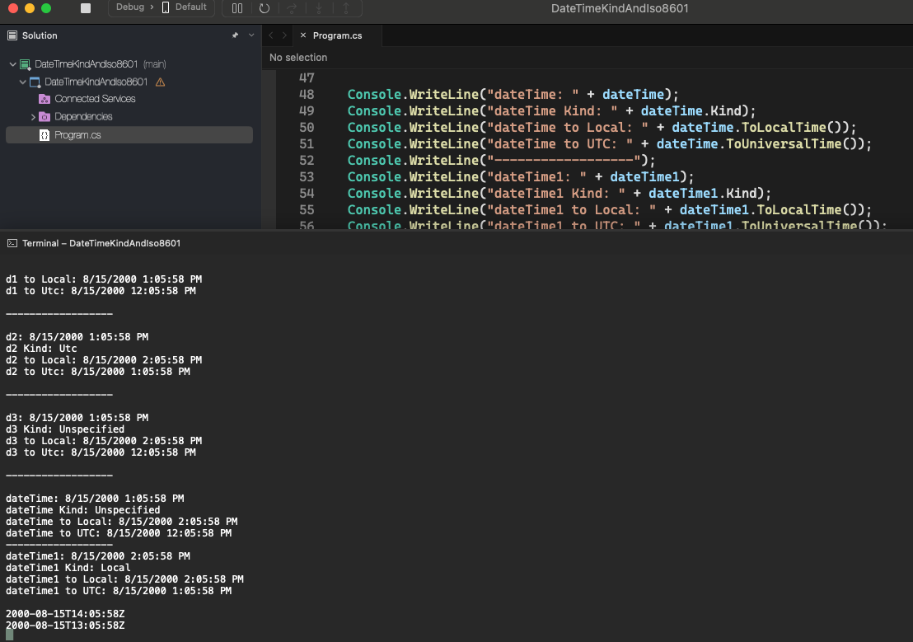

# DateTimeKind And Iso8601

    - Exercise to implement DateTimekind And Iso8601.

    - DateTimeKind:
      - Special enumerated type that defines three possible values ​​for the date locale:
        • Location [ system time zone. Example: São Paulo = GMT -3 ] • Utc [ GMT (Greenwich Mean Time) time zone ];
        • Unspecified;

    - Good practice:
      • Store in UTC format (text: BD / Json / XML);
      • Instantiate and display in Local format;
      • To convert a DateTime to Local or UTC, you must use:
        • myDate.ToLocalTime();
        • myDate.ToUniversalTime();

    - ISO 8601 standard:
      • Is international standard to exchange date and time data, to make it easier to integrate systems together;
      • Format:
        • yyyy-MM-ddTHH:mm:ssZ;(* Z indicates that the date/time is in Utc);

  

