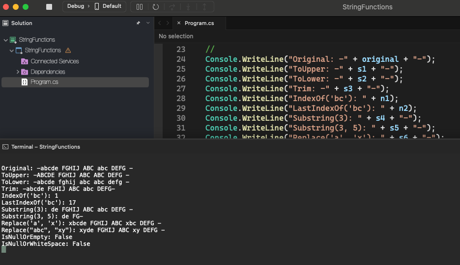

# String Functions

    - Exercise to review String Functions;

### Interesting string functions

    • Format: ToLower(), ToUpper(), Trim();
    • Search: IndexOf, LastIndexOf;
    • Crop: Substring(inicio), Substring(inicio, tamanho);
    • To replace: Replace(char, char), Replace(string, string);
    • String.IsNullOrEmpty(str), String.IsNullOrWhiteSpace(str);
    • str.Split(' ');
    • Conversion to number: int x = int.Parse(str), int x =Convert.ToInt32(str);
    • Number Conversion: str = x.ToString(), str = x.ToString("C"), str = x.ToString("C3"), str = x.ToString("F2");

  

