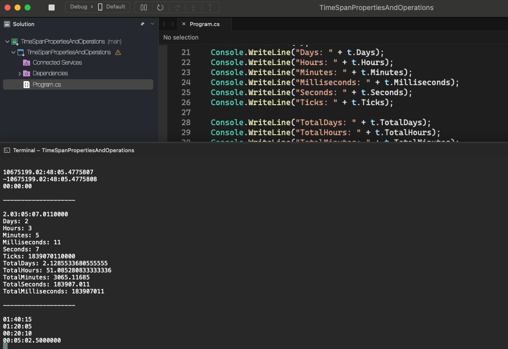

# TimeSpan Properties And Operations

    - Exercise to review TimeSpan properties and operations;

### Properties and Operations with TimeSpan

    • Days;
    • Hours;
    • Milliseconds;
    • Minutes;
    • Seconds;
    • Ticks;
    • TotalDays;
    • TotalHours;
    • TotalMilliseconds;
    • TotalMinutes;
    • TotalSeconds;

  

