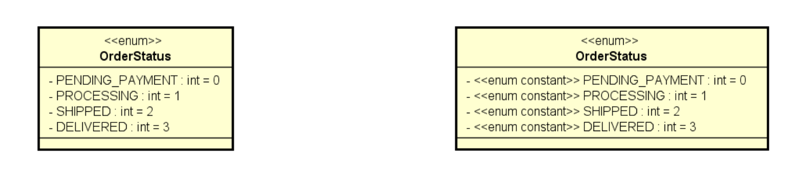
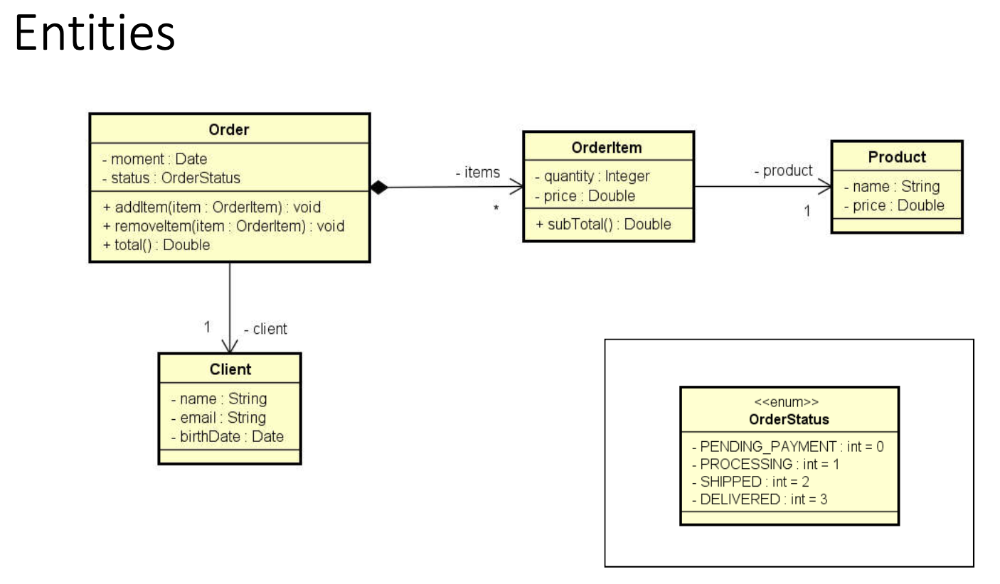

# 09 Section - Enumeration(Enums) and Composition

      - This section was a recap of Enumeration(Enums) and Composition in C#.

### Enumeration(Enums)

    - It is a special type that is used to literally specify a set of related constants;

    - Keyword in C#: enum:
      • Note: enum is a value type;

    - Advantage: better semantics, more readable code and supported by the compiler;

    Example:

    enum OrderStatus : int
    {
      PendingPayment = 0,
      Processing = 1,
      Shipped = 2,
      Delivered = 3
    }

    class Order
    {
      public int Id { get; set; }
      public DateTime Moment { get; set; }
      public OrderStatus Status { get; set; }
    }

    - UML Notation:

  

### Composition

    • It is a type of association that allows one object to contain another;

    • “has-one” or “has-several” relationship:
      • Advantages;
      • Organization: division of responsibilities;
      • Cohesion;
      • Flexibility;
      • Reuse;

    • Note: although the UML symbol for composition (whole-part) is the black diamond, in this context we are calling any “has-one” and “has-many” association composition.

  

