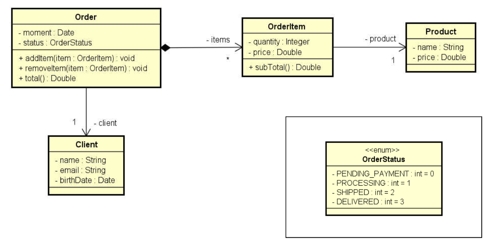
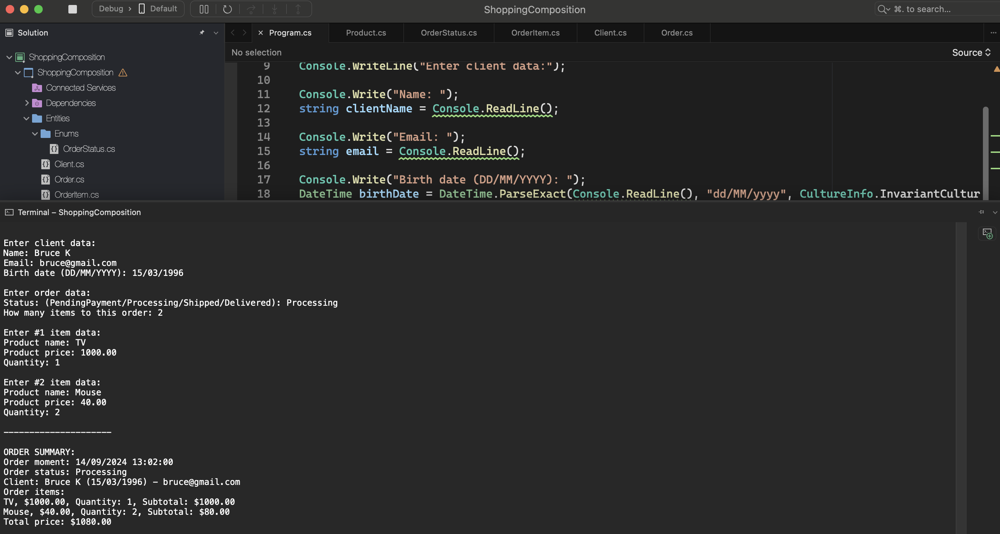

# Shopping Composition

    - Read data from an order with N items (N provided by the user). Then, show a summary of the order. Note: the order time must be the system time: DateTime.Now.

  

  

