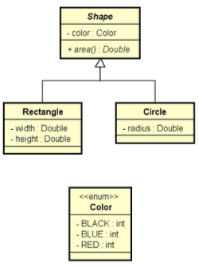
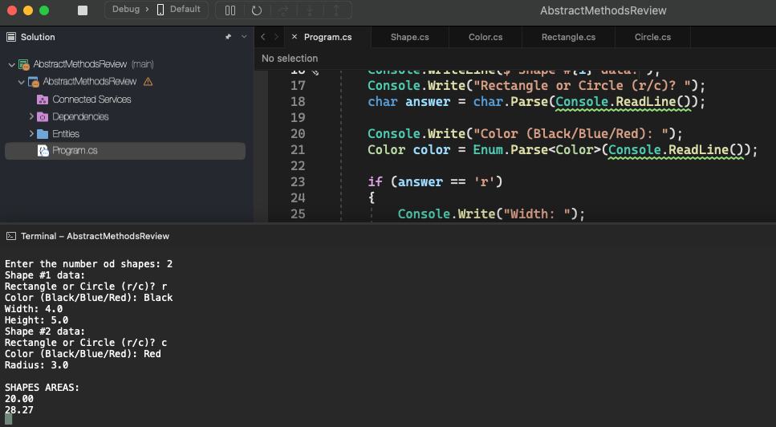

# Abstract Methods Review

    - Make a program to read data from N figures (N provided by the user), and then display the areas of these figures in the same order in which they were entered.

  

  

