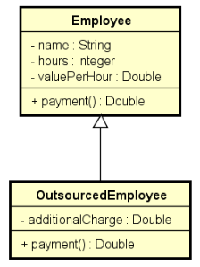
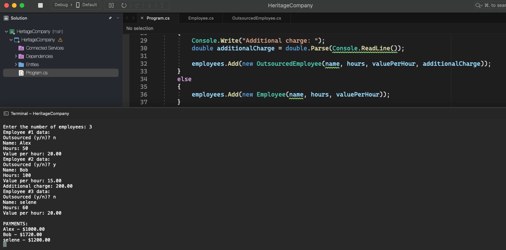

# Heritage Company

    - A company has its own and outsourced employees. For each employee, you want to record name, hours worked and hourly rate. Outsourced employees also have an additional expense.
    Employee pay corresponds to the hourly rate multiplied by the hours worked, and outsourced employees also receive a bonus corresponding to 110% of their additional expense.
    Make a program to read data from N employees (N provided by the user) and store them in a list. After reading all the data, show each employee's name and payment in the same order in which they were entered.
    Build the program according to UML.

  

  

