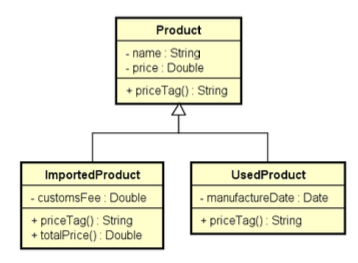
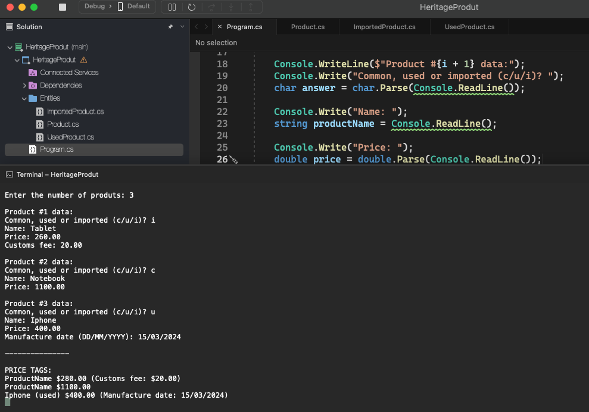

# Heritage Produt

    - Make a program to read data from N products (N provided by the user). At the end, show the price tag of each product in the same order in which they were entered.
    Every product has a name and price. Imported products have a customs fee, and used products have a manufacturing date. This specific data must be added to the price tag as per the example (next page). For imported products, the tax and customs must be added to the final price of the product.
    Please implement the program according to UML.

  

  

