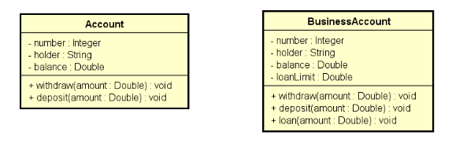
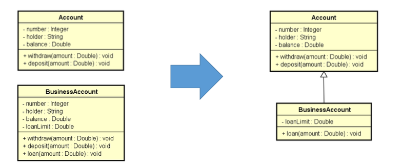
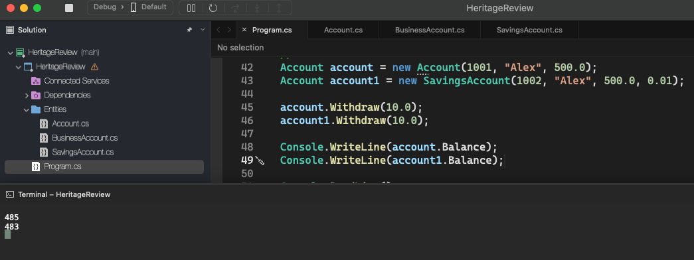

# Heritage Review

    - Suppose a bank business has a common account and a business account, with the business account having all members of the common account, plus a loan limit and a loan operation.

  

    - Inheritance allows the reuse of attributes and methods (data and behavior):

  

  

