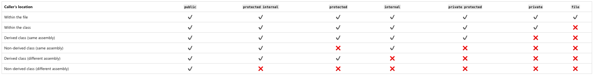
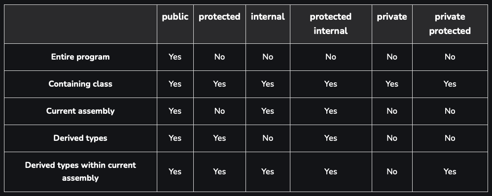

# 10 Section - Inheritance and Polymorphism

      - This section was a recap of inheritance and polymorphism.

### Inheritance

    • It is a type of association that allows one class to inherit data and behaviors from another;
    • Important definitions;
    • Advantages;
    • Reuse;
    • Polymorphism;
    • Syntax;
    • : (extends);
    • base (reference to the superclass);

### Polymorphism

    - In Object Oriented Programming, polymorphism is a resource that allows variables of the same, more generic type, to point to objects of different specific types, thus having different behaviors depending on each specific type.

### Access Modifiers

  

  

### Upcasting and Downcasting

    - Upcasting:
      • Casting from subclass to superclass;
      • Common use: polymorphism;

    - Downcasting:
      • Casting from superclass to subclass;
      • Word as;
      • Word is;
      • Common use: methods that receive generic parameters (ex: Equals);

### Overlay, virtual keyword, override and base keyword

##### Overwriting or Override

    • It is the implementation of a method from a superclass in the subclass;
    • For a common (non-abstract) method to be overridden, the prefix "virtual" must be included in it;
    • When overriding a method, we must include the prefix "override" in it;

##### Base keyword

    • You can call the superclass implementation using the base word;

### Sealed classes and methods

    • Keyword: sealed;
    • Class: prevents the class from being inherited;
    • Note: it is still possible to extend the functionality of a sealed class using "extension methods";

    namespace Course {
       sealed class SavingsAccount {

    • Method: prevents an overridden method from being overridden again;
    • Can only be applied to overridden methods;

### Abstract classes

    • These are classes that cannot be instantiated;
    • It is a way to guarantee full inheritance: only non-abstract subclasses can be instantiated, but never the abstract superclass;

### Abstract methods

    • Abstract methods;
    • These are methods that have no implementation;
    • Methods need to be abstract when the class is too generic to contain its implementation;
    • If a class has at least one abstract method, then this class is also abstract;
    • UML notation: italics;
