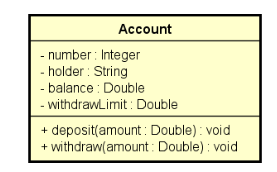
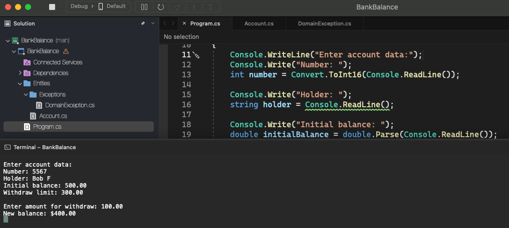
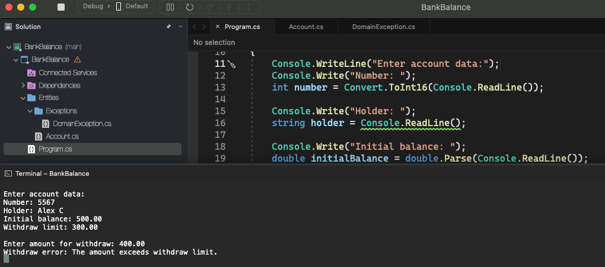
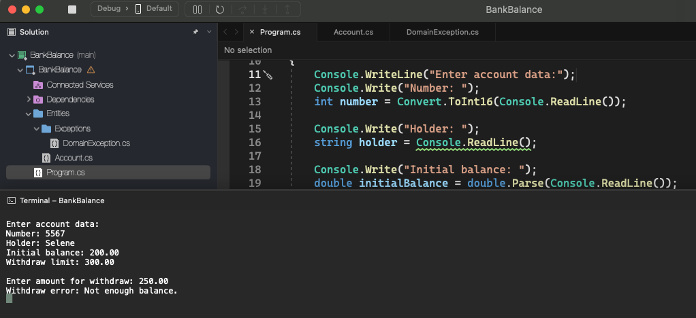

# Bank Balance

    - Create a program to read data from a bank account and then make a withdrawal from this bank account, showing the new balance. A withdrawal cannot occur either if there is no balance in the account, or if the withdrawal amount exceeds the account's withdrawal limit. Implement the bank account according to the UML:

  

  

  

  

