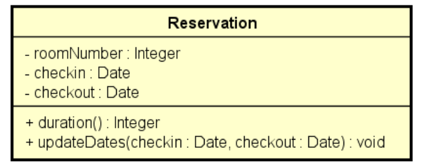
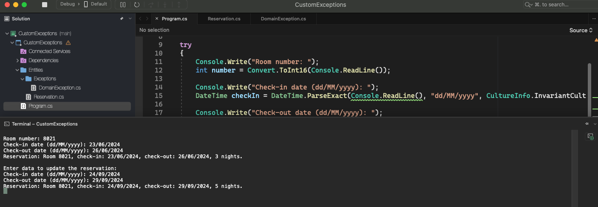
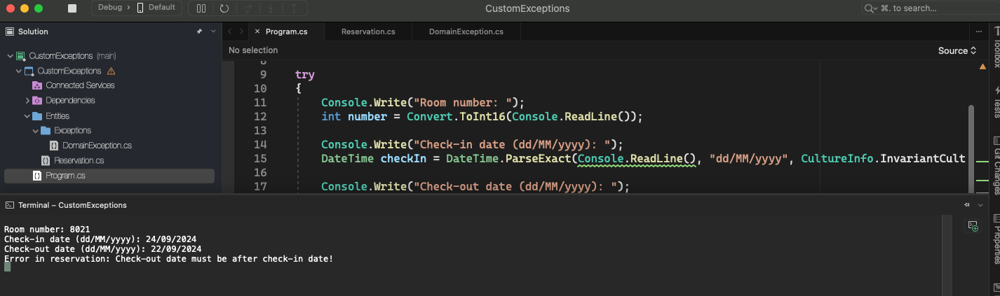
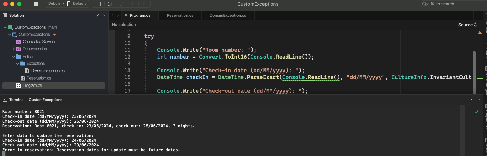

# Custom Exceptions

    - Create a program to read the data from a hotel reservation (room number, check-in date and check-out date) and display the reservation data, including its duration in days. Then, read new arrival and departure dates, update the reservation, and show the reservation again with the updated data. The program must not accept invalid data for the reservation, according to the following rules:
      - Reservation changes can only occur for future dates;
      - The departure date must be greater than the arrival date;

  

  

  

  

