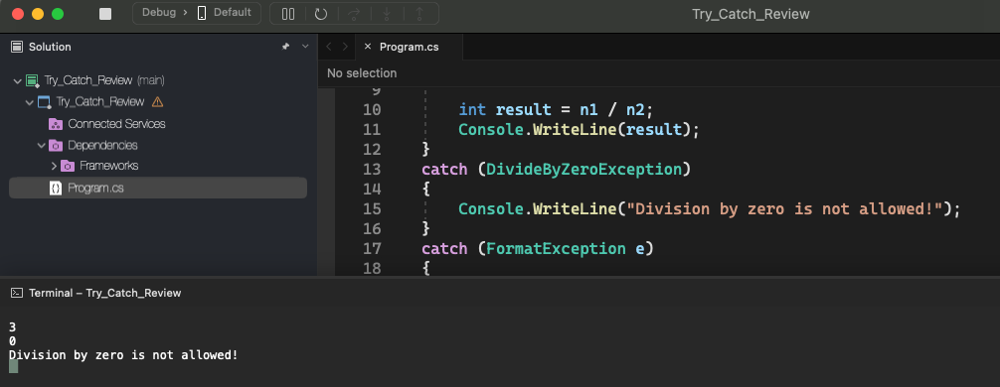

# Try Catch Review

### try-catch structure

    • Try block:
      • Contains the code that represents the normal execution of the piece of code that may result in an exception;

    • Catch block:
      • Contains the code to be executed if an exception occurs;
      • The type of exception to be handled must be specified (upcasting is allowed);

##### Syntax

    try
    {

    }
    catch (ExceptionType e)
    {

    }
    catch (ExceptionType e)
    {

    }
    catch (ExceptionType e)
    {

    }

  

### Finally block

    • It is a block that contains code to be executed regardless of whether an exception has occurred or not.
    • Classic example: closing a file or database connection at the end of processing.

##### Syntax

    try
    {

    }
    catch (ExceptionType e)
    {

    }
    finally
    {

    }
