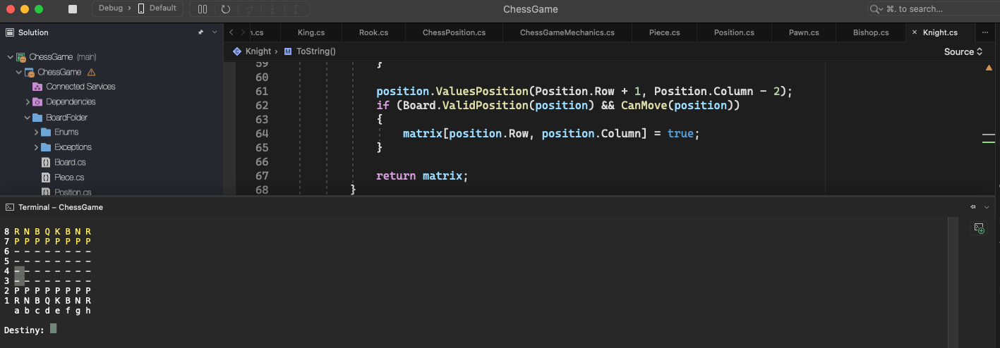
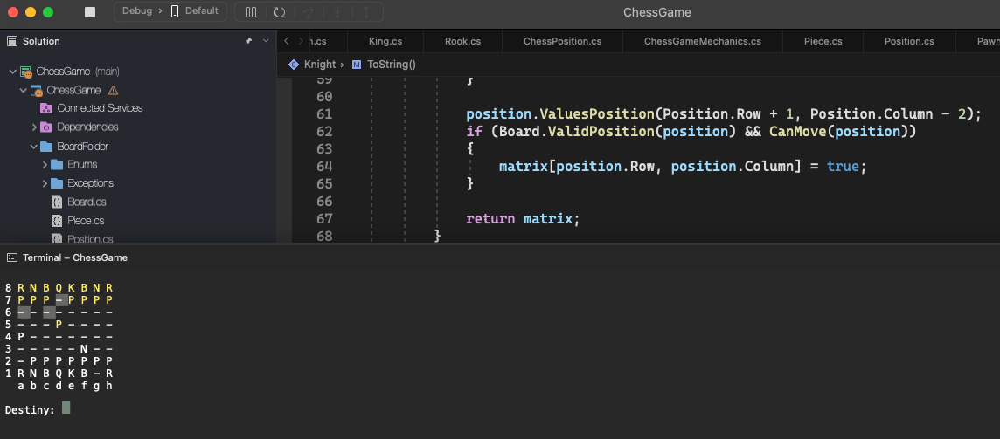

# Chess Game

    - Chess game project in C#. 1 player against the CPU;
    - Each player has 16 pieces:chess pieces:
      • 1 King;
      • 1 Queen;
      • 2 Rooks (or Castles);
      • 2 Bishops;
      • 2 Knights;
      • 8 Pawns;

### How Chess Pieces Move in a Game

    • The King moves one square in any direction—horizontally, vertically, or diagonally;
    • The Rook moves any number of squares horizontally and vertically along its row or column;
    • The Bishop moves any number of squares diagonally;
    • The Queen combines the movements of the Rook and Bishop, moving any number of squares in any direction;
    • The Knight (not “horse”) jumps in an "L" shape, two squares in one direction and one square perpendicular;
    • The Pawn moves one square forward, or two squares from its starting position, but moves diagonally to capture an opponent’s piece;
    • The motion of a Rook, Bishop, or Queen stops when it strikes an occupied square;

### There are also a few special maneuvers where two pieces move at the same time

    • Capture: When a piece moves to a square occupied by an opponent's piece, which is then removed from the board;
    • Castling: A strategic move where the king and one rook move at the same time, done to increase the king's safety and the rook's activity;
    • Pawn Promotion: When a pawn reaches the far end of the board, it is promoted and replaced by a queen, rook, bishop, or knight of the same color. If it becomes a queen, the process is referred to as "queening" the pawn;

### Chess pieces

    • K for King;
    • Q for Queen;
    • N for Knight;
    • R for Rook;
    • B for Bishop;
    • P for Pawn;

### Chess system architecture

    - Application layer;

    - Chess game layer;

    - Board layer;

  

  

