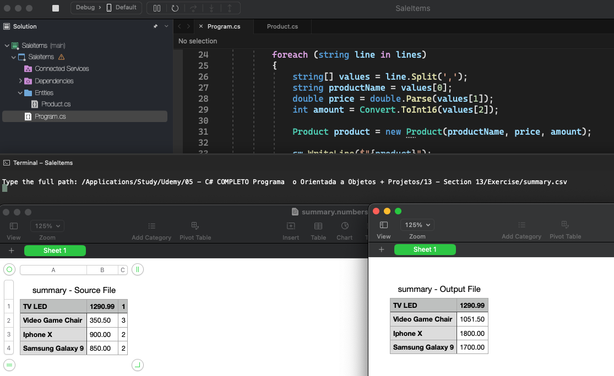

# Sale Items

    - Make a program to read the path of a .csv file containing sold item data. Each item has a name, unit price and quantity, separated by a comma. You must generate a new file called "summary.csv", located in a subfolder called "out" from the original source file folder, containing only the name and total value for that item (unit price multiplied by quantity);

  

