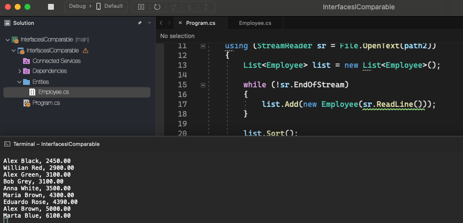

# Interfaces IComparable

    - Write a program to read a file containing employees (name and salary) in .csv format, storing them in a list. Then, sort the list by salary and display the result on the screen. Note: the file path may be entered as "hardcode";

  

